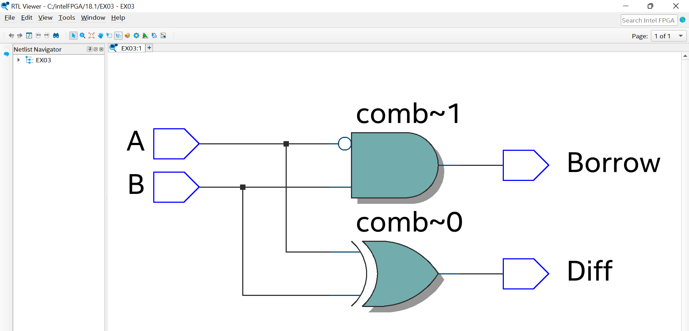

# Experiment--03-Half-Subtractor-and-Full-subtractor
## Implementation-of-Half-subtractor-and-Full-subtractor-circuit
## AIM:
To design a half subtractor and full subtractor circuit and verify its truth table in Quartus using Verilog programming.

## Equipments Required:
## Hardware – PCs, Cyclone II , USB flasher
## Software – Quartus prime
## Theory
Subtractor circuits take two binary numbers as input and subtract one binary number input from the other binary number input. Similar to adders, it gives out two outputs, difference and borrow (carry-in the case of Adder). There are two types of subtractors.

## Half Subtractor Full Subtractor
## Half Subtractor
The half-subtractor is a combinational circuit which is used to perform subtraction of two bits. It has two inputs, X (minuend) and Y (subtrahend) and two outputs D (difference) and B (borrow). To perform x - y, we have to check the relative magnitudes of x and y. If x ;;, y, we have three possibilities: 0 - 0 = 0, 1 - 0 = 1, and 1 - I = 0. The result is called the difference bit. If x < y, we have 0 - I, and it is necessary to borrow a 1 from the next higher stage. The I borrowed from the next higher stage adds 2 to the minuend bit, just as in the decimal system a borrow adds 10 to a minuend digit. With the minuend equal to 2, the difference becomes 2 - I = 1. The half-subtractor needs two outputs. One output generates the difference and will be designated by the symbol D. The second output, designated B for borrow, generates the binary signal that informs the next stage that a I has been borrowed.


Sum = X'Y+XY' = X ⊕ Y
Carry=X'Y

## Full Subtractor
A full subtractor is a combinational circuit that performs subtraction involving three bits, namely minuend, subtrahend, and borrow-in . It accepts three inputs: minuend, subtrahend and a borrow bit and it produces two outputs: difference and borrow. 


Diff = A ⊕ B ⊕ Bin B = A'Bin + A'B + BBin

## Procedure


Write the detailed procedure here 


## Program:
/*
Program to design a half subtractor and full subtractor circuit and verify its truth table in quartus using Verilog programming.
Developed by: Karthikeyan R
RegisterNumber:  22009322
*/
```
Half Subtractor :

module ex03(A,B,Diff,Borrow);
input A,B;
output Diff,Borrow;
wire X;
xor(Diff,A,B);
not(X,A);
and(Borrow,X,B);
endmodule

Full Subtractor:

module ex03(A,B,C,Diff,Borrow);
input A,B,C;
output Diff,Borrow;
assign Diff = A^B^C;
assign Borrow = ~A & (B^C) | B & C;
endmodule
```
## Output:
HALF SUBRACTOR
# Logic daigram

# Truthtable


# RTL


# Timging daigram


FULL SUBRACTOR
## Logic diagram


## Truthtable

# RTL

# Timing diagram 

## Result:
Thus the half subtractor and full subtractor circuits are designed and the truth tables is verified using quartus software.
